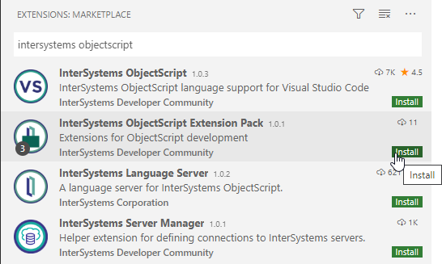
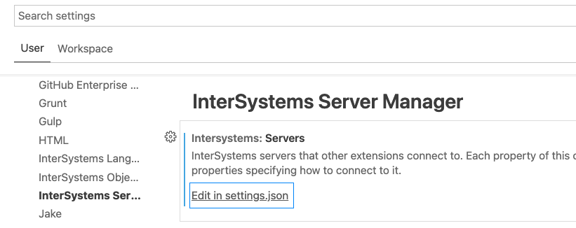
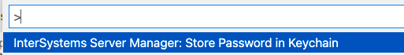

# Workshop: Containers Intro
This repository contains some examples you can use to learn about using VS Code with InterSystems IRIS.

# What do you need to install? 
* [Git](https://git-scm.com/downloads) 
* [Docker](https://www.docker.com/products/docker-desktop) (if you are using Windows, make sure you set your Docker installation to use "Linux containers").
* [Docker Compose](https://docs.docker.com/compose/install/)
* [Visual Studio Code](https://code.visualstudio.com/download)

# Examples

## (a). Setup

Run an InterSystems IRIS container. If you are running Docker on Windows please, un-comment the `command` section in [docker-compose.yml](docker-compose.yml) file to avoid errors with the checking of Linux capabilities.

```
docker-compose up -d
```

## (b). Install extensions on VS Code

Make sure you have installed the following extensions in VS Code by clicking on the extensions button.


* InterSystems Language Server
* InterSystems ObjectScript
* InterSystems Server Manager




## (c). Check your InterSystems Server Manager connections

Connections to IRIS instances will be managed by InterSystems Server Manager extension.

* Have a look at them through *Settings > Extensions > InterSystems Server Manager > Edit in settings.json*



* Create a new connection in the InterSystems Server Manager to your local instance as follows:

```
 "test~iris": {
            "webServer": {
                "scheme": "http",
                "host": "127.0.0.1",
                "port": 52773
            },
            "username": "superuser"
        },
```

## (d). Connect to your instance in a VS Code project

* Open a local directory in VS Code
* Create a new `.vscode\settings.json` to specify the IRIS instance connection you want to use in the project:

```
{
    "objectscript.export.folder": "src",
    "objectscript.conn": {
        "active": true,
        "ns": "USER",
        "server": "test~iris"
    },
}
```

* VS Code will ask you for the password you want to use. However, you can store you password in a secure way using through settings button  and then *Command Palette > InterSystems Server Manager: Store Password in keychain*



## (e). Edit some classes

* Click on InterSystems logo button and check the classes on the instance.
* Select *Sample.MyClass" and export it to your local project directory.
* Now you can edit your class, after a save your class will be saved and compiled on the instance.

## (f). Debugging

* Have a look at the debugging options in the documentation: https://intersystems-community.github.io/vscode-objectscript/rundebug/
* Click on Run-Debug button 
* Create a new `launch.json` configuration file as follows:

```
{
    // Use IntelliSense to learn about possible attributes.
    // Hover to view descriptions of existing attributes.
    // For more information, visit: https://go.microsoft.com/fwlink/?linkid=830387
    "version": "0.2.0",
    "configurations": [
        {
            "type": "objectscript",
            "request": "launch",
            "name": "Test ClassMethod",
            "program": "##class(Sample.MyClass).Test()"
        }
    ]
}
```

* Set a break-point in `Sample.MyClass:Test()` and run your debugging configuration
